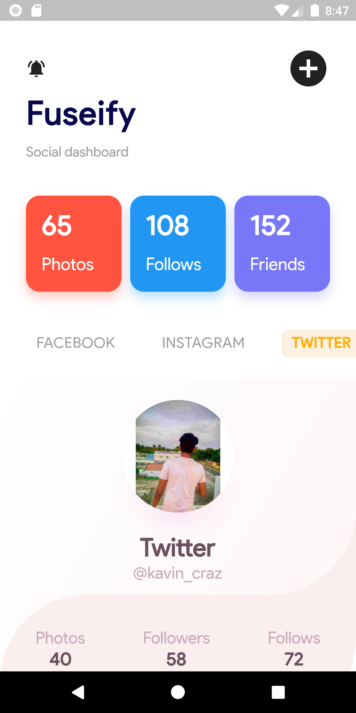
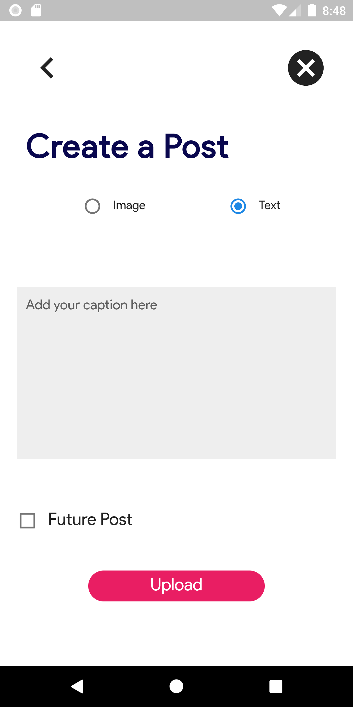
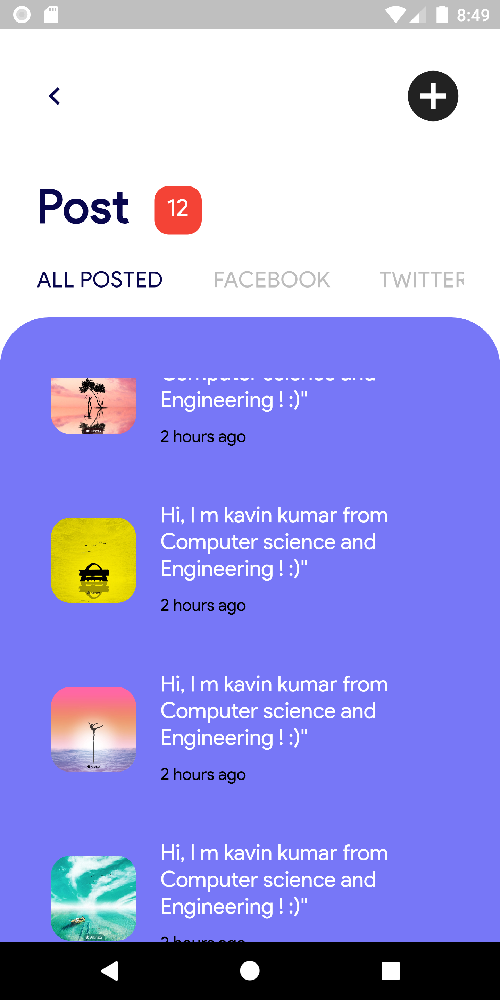

<!-- app name -->
<br />
<p align="center">
  <a href="">
    
  </a>

  <h3 align="center">FUSEIFY</h3>

  <p align="center">
    Connect socially using single touch ! 
    <br />
    <a href=""><strong>Explore the docs »</strong></a>
    <br />
    <br />
  </p>
</p>

<details open="open">
  <summary>Table of Contents</summary>
  <ol>
    <li>
      <a href="#about-the-project">About The Project</a>
      <ul>
        <li><a href="#built-with">Built With</a></li>
      </ul>
    </li>
    <li>
      <a href="#getting-started">Getting Started</a>
    </li>
    <li><a href="#screenshots">Screenshots</a></li>
  </ol>
</details>


<!-- ABOUT THE PROJECT -->
## About The Project

we are introduce the app “Fuseify”,the real social media integration to helps the user to interact the different social media platform in the single dashboard. This will help to reach the wider audience over the quality time span

### Built With

Flutter is Google’s UI toolkit for building beautiful, natively compiled applications for mobile, web, and desktop from a single codebase. Flutter's hot reload helps you quickly and easily experiment, build UIs, add features, and fix bugs faster
* [Flutter](https://flutter.dev/)


<!-- GETTING STARTED -->
## Getting Started


### Step 1
Download or clone this repo by using the link below:
   ```sh
   git clone https://github.com/kavinkumar999/Fuseify.git
   ```
### Step 2
Go to project root and execute the following command in console to get the required dependencies:
   ```sh
   flutter pub get 
   ```
### Step 3
Run the application using the following command
   ```sh   
   flutter run
   ```


<!-- EXAMPLES -->
## Screenshots
<div align = "left" >
     
     
    
    
  
  
  
</div>


   
  
  
  


<!-- CONTACT -->
## Contact

[@kavinkumar](https://github.com/kavinkumar999) 

[Application Link] 


